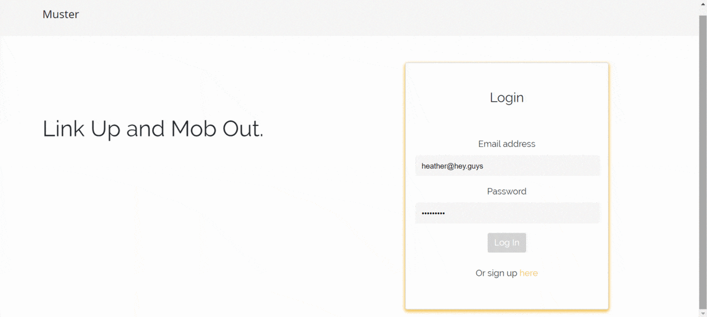
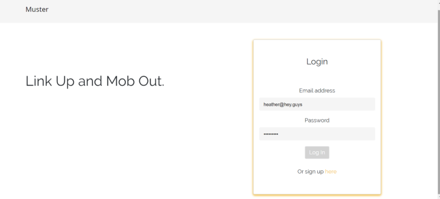
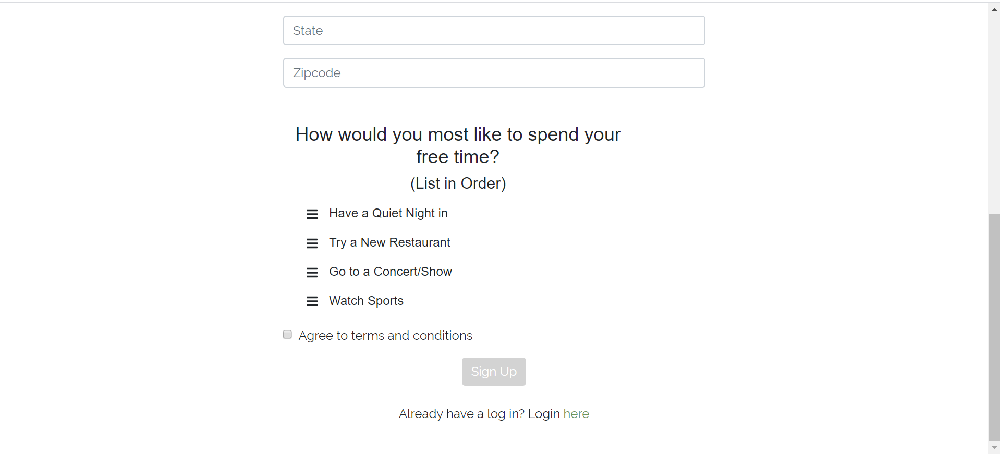

# Muster

## Welcome to Muster

Muster was designed as a minimalistic social media website where people can connect through events.

## Walk-Through

Muster.com first takes you to the landing page where users can either sign in or sign up. 
Logins and user information are stored with a mongoDB and called with Mongoose.
They are encrypted with passport.

On the signup page, users answer a few questions. These answers are stored in the mongoDB and will be used to facilitate suggested events and suggested friends

The form autofills and uses validations to ensure all fields are entered and an email address format is detected (further development: add email verification by incorporating an email api -like sendgrid-)

The last question is a drag and drop! Users drag and drop the options to rank their favorite ways to spend a night out from least to greatest. This information will be used to facilitate suggested events and suggested friends.

