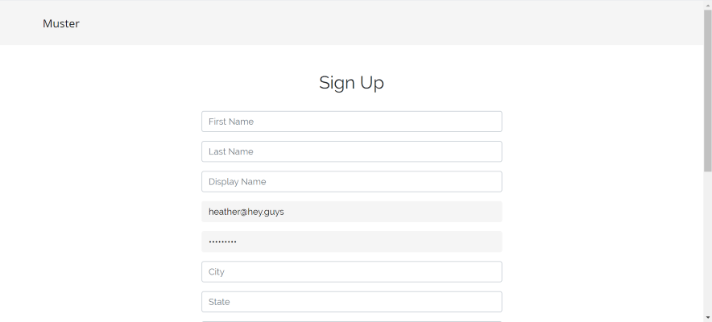
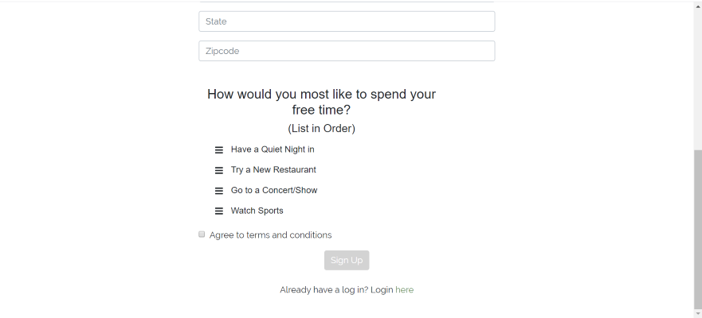
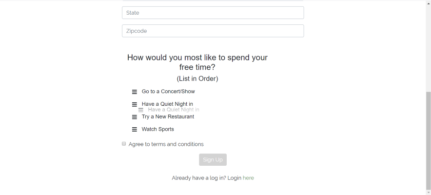
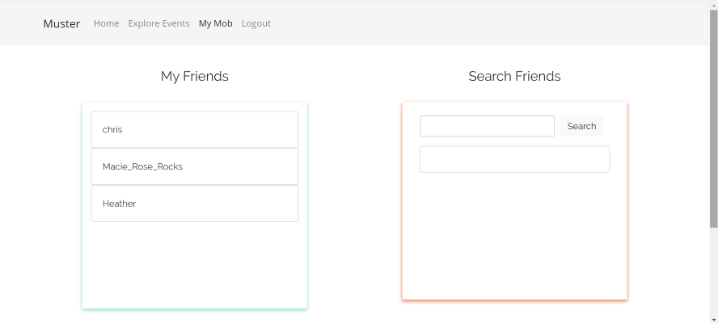

# Muster

## Welcome to Muster

Muster was designed as a minimalistic social media website where people can connect through events.

## Walk-Through

Muster.com first takes you to the landing page where users can either sign in or sign up. 
Logins and user information are stored with a mongoDB and called with Mongoose.
They are encrypted with passport.

On the signup page, users answer a few questions. These answers are stored in the mongoDB and will be used to facilitate suggested events and suggested friends

The form autofills and uses validations to ensure all fields are entered and an email address format is detected (further development: add email verification by incorporating an email api -like sendgrid-). Display names and emails must be unique.

The last question is a drag and drop! Users drag and drop the options to rank their favorite ways to spend a night out from least to greatest. This information will be used to facilitate suggested events and suggested friends.

Once successfully signing up or securely logging in, users arrive at the home screen. All logged in routes are controlled. A non-verified user will always be redirected to the login page if they tried to access a logged in route. 

The mob page shows the list of friends the user has linked up with (their mob) with the option to search for friends. For now, all new users are friends with each other (to showcase how it works). The long-term plan is to include an array of each users friends' display names and ids in the db. This would allow us to display only their friends and in the background access information (such as the events friends are attending, their location, etc.) from each person's id.

The Explore Events page was a focus and a priority for this project. It incorporates two different APIs (react-big-calendar and seatgeek). It allows users to search for any events and populates the calendar with all events within a 50 mile radius of their current location. Users can select the event for additional details and save the event or continue exploring. Navigating to different dates on the calendar updates the displayed results for the displayed date range. This was accomplished by managing 4 different asynchronous processes. 1) Selected Dates on the calendar (defaulted to the current day through the end of the month). 2) User search query. 3) Seatgeek API call. 4) Interacting with the DB (to pull up already saved events within displayed dates and adding additional saved events). 

Further development would include re-formatting the additional details displayed on the event popup, and allowing the user to customize the location of events searched and the radius of miles from the selected location.

Once a User has saved an event, it is stored in the db. When a User navigates back to their homepage, (if it is within the next week) it will now display on their userWeek.

From here, the User can select the event to view additional details 

The User can also select any day of the week to view events they or their friends are attending that day

Although there is still a lot of work needed to finish and polish this project, I am proud of where it as after only 10 days of development. 

